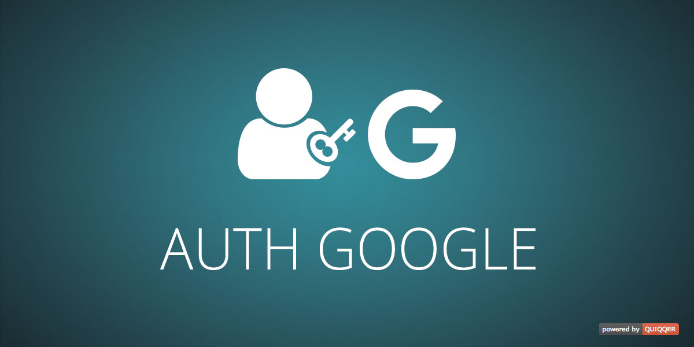

QUIQQER Google authentication and registration
========

This module provides a Google registration option for the `quiqqer/frontend-users` module and enables Google
authentication in QUIQQER. Users can register and sign in with their Google account.

Package Name: `quiqqer/authgoogle`

Features
--------

* Registration via Google account (requires `quiqqer/frontend-users`)
* Authentication via Google account

Installation
------------

The Package Name is: `quiqqer/authgoogle`

Contribute
----------

- Project: https://dev.quiqqer.com/quiqqer/authgoogle
- Issue Tracker: https://dev.quiqqer.com/quiqqer/authgoogle/issues
- Source Code: https://dev.quiqqer.com/quiqqer/authgoogle/tree/master
- Wiki: https://dev.quiqqer.com/quiqqer/authgoogle/-/wikis/home

Support
-------

If you have found errors, wishes or suggestions for improvement,
you can contact us by email at support@pcsg.de.

We will transfer your message to the responsible developers.

License
-------

GPL-3.0+
