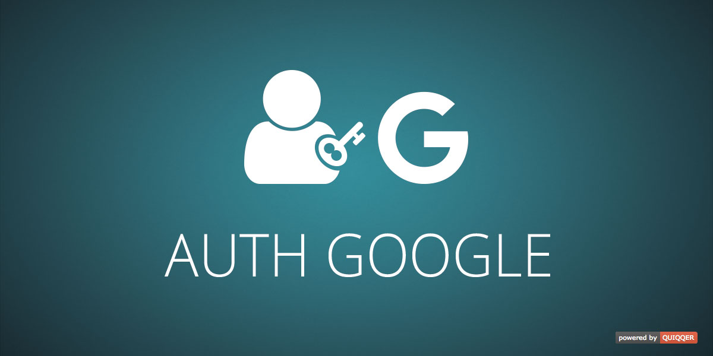

# Google authentication for QUIQQER

`quiqqer/authgoogle` adds Google authentication to QUIQQER. It provides both a primary authenticator and a registration option for `quiqqer/frontend-users`.

## Requirements

- PHP 8.2 or newer
- QUIQQER Core 2.24 or newer
- `quiqqer/frontend-users` 2.12.5 or newer
- A Google Cloud OAuth 2.0 client

## Installation

Install the package through the QUIQQER package manager or with Composer:

```bash
composer require quiqqer/authgoogle
```

Run the QUIQQER setup after installation so the package database table, settings, events, and providers are registered.

## Configuration

Create an OAuth 2.0 web client in Google Cloud Console. Open the frontend-users settings in the QUIQQER administration, select the Google authentication section, and enter the client ID.

Register this package URL as an authorized redirect URI for the Google client:

```text
https://your-domain.example/opt/quiqqer/authgoogle/bin/oauth_callback.php
```

The exact `/opt/` path may differ if the installation uses a custom QUIQQER optional-package URL. The registration settings also control whether accounts with unverified Google email addresses may register.

## Usage

After configuration, the Google button is available in the QUIQQER login and frontend registration flows. A successful registration links the Google subject identifier to the created QUIQQER user.

## Development

Initialize and run the package-local quality tools with:

```bash
composer dev:init
composer test
```

The test command runs PSR-12 checks, PHPStan level 8, and PHPUnit.

## Support

- Issues: https://dev.quiqqer.com/quiqqer/authgoogle/issues
- Source: https://dev.quiqqer.com/quiqqer/authgoogle
- Email: support@pcsg.de

## License

GPL-3.0-or-later
